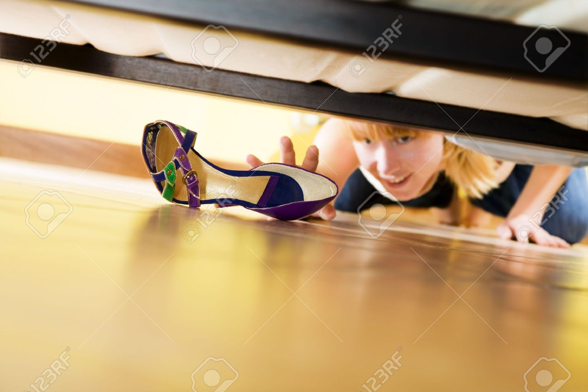

Project Ideas:
  1. Retrieving Objects from hard to reach places
      * Problem we will address: Getting objects from hard to reach places. 
      * Supporting evidence: 
        Have you ever dropped something under the bed or cabinet, and have to crawl
        and pick it up using a cloth hanger? It’s a frustrating experience most people
        have run into, but this task is especially difficult for older people.   
      * Target user group: 
        anyone, but would be especially useful for senior people and people with 
        disabilities.
      * Pictures: 
        
      * Cozmo-based solution:
        Cozmo would be a good solution because it’s small and can get in certain
        hard to reach places. Better than alternatives like human effort or using
        a stick, because this requires no effort on the part of the person, Cozmo
        will just retrieve the object for you. Cozmo comes with Computer Vision
        and a decent Navigation system so it can certainly find and retrieve objects,
        the caveat being the object has to be small enough for cozmo to lift. Cozmo
        cannot lift objects too high, it can only move objects onto the same surface,
        if people set up ramps between different surface heights, Cozmo can move up
        and down, but requires initial setup, may not be the most tractable. 
        
        **Note:** Depending on whether Cozmo’s front facing light is accessible and powerful enough.
        Our solution can vary from getting objects in hard to reach places or just hard to reach
        lighted places
        
  2. Cleaning Surfaces
      * Problem we will address: Cleaning surfaces
      * Personal experience: 
      Cleaning can be an easy job, but it’s tedious and people have to redo it all
      the time. It can also be hard to clean certain surfaces such as tall shelves,
      countertops, and narrow surfaces behind furniture.
      * Target user group: anyone, people who have a space that needs to be cleaned up frequently.
      * Pictures: 
      
      
      * Why use Cozmo?
        Since Cozmo is so small, it can fit into the aforementioned narrow or hard-to-reach
        surfaces more easily and thus clean them properly. This requires significantly less effort
        than removing the furniture, or getting a chair to access these surfaces and cleaning them by
        hand. In fact all that needs to be done is attach a disinfectant wipe to the cozmo, place it
        on a part of the surface you can reach and it’s vision and planning algorithms will handle
        the rest. This is better than using Roomba especially for narrow surfaces like countertops,
        because it’s small enough to fit. To solve this problem we just need to add some implement to
        the Cozmo such that it carries a disinfectant wipe with it. Make sure the wheels are sanitized
        or this defeats the whole purpose. We need to design a vision and mapping algorithm to make sure
        it stays on the surface it’s cleaning as well as cleans the entire surface.

